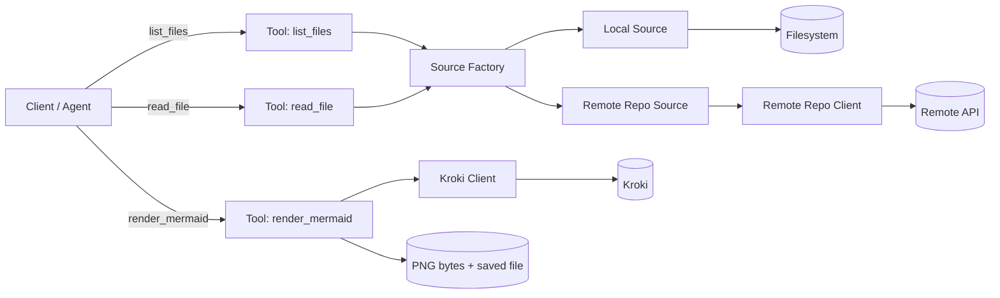

# Architecture — mermaid-mcp

This document explains the architecture of **mermaid-mcp**: how responsibilities are split, how requests flow through the system, and how the design supports safe access, predictable behavior, and easy extensibility.

<!-- Table of contents for quick navigation -->
## Table of contents

- [Goals](#goals)
- [Architecture at a glance](#architecture-at-a-glance)
- [Directory map (where things live)](#directory-map-where-things-live)
- [Request flow](#request-flow)
- [The Source contract (the core idea)](#the-source-contract-the-core-idea)
- [Source Factory (how backends are selected)](#source-factory-how-backends-are-selected)
- [Component responsibilities](#component-responsibilities)
- [Path and filtering semantics (stable behavior)](#path-and-filtering-semantics-stable-behavior)
- [Cross-cutting policies (why they exist)](#cross-cutting-policies-why-they-exist)
- [Interaction diagram (high-level)](#interaction-diagram-high-level)
- [Error boundaries (who raises what)](#error-boundaries-who-raises-what)
- [Security boundaries and predictable behavior](#security-boundaries-and-predictable-behavior)
- [Extending the system: adding a new source](#extending-the-system-adding-a-new-source)
- [Design tradeoffs](#design-tradeoffs)

---

## Goals

- **Backend-agnostic tools**: tools should not depend on whether files come from a local folder or a remote repository.
- **Contract-driven design**: one clear contract defines what a “source” is and how it behaves.
- **Predictable runtime behavior**: bounded reads, safe output paths, and stable performance under concurrency.
- **Extensibility**: adding new sources should not require changing tools.

---

## Architecture at a glance

The server exposes three MCP tools:

- `list_files` — discover files in a source
- `read_file` — read file contents with a configured limit
- `render_mermaid` — render Mermaid → PNG via Kroki and save output

The system is organized into four layers:

1. **Tools** — MCP surface and orchestration
2. **Sources** — backends that implement the Source contract
3. **Clients** — thin wrappers around external services (GitHub/Kroki)
4. **Core** — shared contracts and cross-cutting primitives

---

## Directory map (where things live)

```text
src/
  server/                 # MCP server entrypoint and registration
  tools/                  # MCP tools (list_files / read_file / render_mermaid)
  sources/                # Source implementations + source factory
  clients/                # External service wrappers (GitHub / Kroki)
  core/                   # Shared contracts, errors, models, policies (cache/pacing/rate limiting)
```

---

## Request flow

A typical end-to-end pipeline:

1. The client/agent calls `list_files`.
2. The tool selects a backend source (Local / GitHub) via the factory.
3. The tool calls `source.list_files(...)`.
4. The client/agent selects a small set of files and calls `read_file`.
5. The tool calls `source.read_file(...)`.
6. The client/agent generates Mermaid from real content.
7. The client/agent calls `render_mermaid` to produce PNG output.

---

## The Source contract (the core idea)

The Source contract is the interface that all backends must implement. Tools interact with sources only through this contract, which keeps tools backend-agnostic.

### Contract surface

The Source instance is created by the factory with any backend configuration baked in (e.g., `project_root` for local, `repo_url`/`ref` for GitHub). The tool layer does not perform backend-specific logic beyond selecting/instantiating the source.

Pseudo-signature (conceptual):

```python
class Source:
    async def list_files(
        self,
        *,
        root: str = ".",
        glob: str = "**/*",
        recursive: bool = True,
    ) -> list[str]:
        ...

    async def read_file(
        self,
        *,
        path: str,
        max_chars: int,
    ) -> str:
        ...
```

### Contract guarantees

All Source implementations must guarantee:

- Normalized paths in results: `list_files(...)` returns paths in a stable, normalized form (recommended: forward slashes `/`, no leading `./`, no trailing slashes).
- Relative-to-source semantics: `root` and `path` are interpreted relative to the source’s base (local project root or remote repo root).
- Bounded reads: `read_file(...)` respects `max_chars` and never returns unbounded content.
- Consistent failure modes:
  - missing file/path → `NotFoundError` (project-level error)
  - invalid inputs (bad URL / illegal path) → `ValidationError`
  - upstream issues (network, throttling after retries, API errors) → `ExternalServiceError`

This contract makes new sources pluggable without changing tools.

---

## Source Factory (how backends are selected)

The factory keeps tools simple and consistent.

### Selection inputs (tool parameters)

At the MCP boundary the tool typically receives:

- `source`: "local" or "github"

For local: `root`, `glob`, `recursive`, etc.

For github: `repo_url` (required), `ref` (optional; the source/client may apply sensible defaults).

### Factory behavior (conceptual)

- If `source == "local"`: create a `LocalSource(project_root=PROJECT_ROOT, ...)`.
- If `source == "github"`: validate `repo_url` and create a `GitHubSource(repo_url=..., ref=..., client=GitHubClient(...), ...)`.

Key rule: backend-specific setup belongs in the factory and source constructors, not in tools.

---

## Component responsibilities

1) Tools (orchestration layer)

What belongs here:

- Input validation at the MCP boundary (required params, type/shape checks).
- Selecting the correct source via the factory.
- Returning results in MCP-friendly formats.
- For `render_mermaid`: output filename sanitization and writing within the allowed output directory.

What does NOT belong here:

- Filesystem containment checks.
- Remote API specifics (headers, pagination, ref quirks).
- Cross-cutting policies (caching, pacing, rate-limit handling).

2) Sources (backend implementations)

Sources implement the Source contract and own backend-specific concerns.

Local source:

- Enforces the `PROJECT_ROOT` boundary (no reads outside).
- Normalizes paths and performs containment checks.
- Applies `MAX_FILE_CHARS` to keep reads bounded.

Remote repository source (GitHub today; others later):

- Translates Source operations into remote API calls.
- Handles ref resolution behavior (including default-branch fallback when appropriate).
- Delegates network concerns to a dedicated client wrapper.

3) Clients (external service wrappers)

Clients are deliberately thin. They should:

- Encapsulate HTTP details (headers, timeouts, response parsing).
- Translate service errors into project-level errors.
- Remain reusable by sources without leaking service-specific quirks.

Kroki client:

- Sends Mermaid text and receives PNG bytes.
- Returns bytes and lets the tool decide output behavior (save path, filename, overwrite policy).

Remote repo client:

- Supports listing and reading with consistent normalization and failure modes.
- Keeps higher layers clean from API mechanics.

4) Core (shared primitives and policies)

Core hosts reusable building blocks used across the project:

- `errors` — project-specific exception types
- `models` — shared data structures
- policy primitives (caching / pacing / rate limiting) used by networked components

Core is where "how we behave" lives, preventing behavioral drift across modules.

---

## Path and filtering semantics (stable behavior)

To keep behavior predictable across sources:

- `root` is a directory-like prefix to scope listing (default `.`).
- `glob` is applied to the candidate file set (default `**/*`).
- `recursive` controls directory traversal depth for backends that support it.

Recommended rule: tools apply the same parameter meanings for both local and remote. If a backend cannot support a parameter precisely, it should approximate reasonably but keep the same output invariants (normalized paths, stable ordering if applicable).

---

## Cross-cutting policies (why they exist)

These policies are runtime safety and stability mechanisms, not service-specific features:

- Bounded reads: prevents runaway memory/time on large files (`MAX_FILE_CHARS`).
- Concurrency cap: prevents too many simultaneous network calls and reduces contention.
- Pacing: avoids burst traffic when many tasks run concurrently.
- Rate-limit handling: respects explicit server throttling signals for predictable retries.
- TTL caching: avoids repeating identical remote reads within short windows.

Outcome: stable tool latency and fewer avoidable failures under load.

---

## Interaction diagram (high-level)



---

## Error boundaries (who raises what)

Tools:

- Validate presence/shape of required parameters and raise `ValidationError` early for malformed tool calls.

Sources:

- Enforce source boundaries (e.g., local containment) and translate "not found" into `NotFoundError`.
- Propagate project-level errors upward (not raw HTTP/filesystem exceptions).

Clients:

- Translate HTTP/network failures into `ExternalServiceError`.
- Handle retryable scenarios internally (rate limit / transient errors) within a bounded retry policy.

Guiding principle: callers should never need to interpret raw HTTP status codes or OS errors.

---

## Security boundaries and predictable behavior

- Local reads are restricted to `PROJECT_ROOT` (path traversal is rejected).
- Output writes are restricted to `DIAGRAM_OUT_DIR` within `PROJECT_ROOT`.
- Reads are bounded by `MAX_FILE_CHARS` to prevent oversized payloads.
- Output filenames derived from `title` are sanitized to be filesystem-safe.
- Network behavior is stabilized via pacing, concurrency caps, and rate-limit handling.

---

## Extending the system: adding a new source

To add a new backend (e.g., GitLab / Bitbucket / ZIP / URL):

1. Implement the Source contract in a new source module.
2. Register it in the factory (selection by `source=...`).
3. Add tests for list/read behavior and boundary conditions.
4. Update docs (README + this architecture doc if needed).

Key point: tools should remain unchanged.

---

## Design tradeoffs

- Contract-first over tool-specific logic: enables clean extensibility.
- Thin clients: keeps service specifics out of tools and sources.
- In-memory TTL caching: fast, simple, and sufficient for a stdio server (not persistent across runs).
- Limited retries: keeps tool calls responsive and avoids retry storms.
