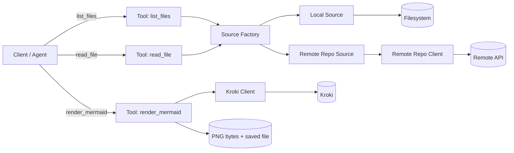

# Architecture — mermaid-mcp

This document explains the architecture of **mermaid-mcp**: how responsibilities are split, how requests flow through the system, and how the design supports safe access, predictable behavior, and easy extensibility.

---

## Goals

- **Backend-agnostic tools**: tools should not depend on whether files come from a local folder or a remote repository.
- **Contract-driven design**: one clear contract defines what a “source” is and how it behaves.
- **Predictable runtime behavior**: bounded reads, safe output paths, and stable performance under concurrency.
- **Extensibility**: adding new sources should not require changing tools.

---

## Architecture at a glance

The server exposes three MCP tools:
- `list_files` — discover files in a source
- `read_file` — read file contents with a configured limit
- `render_mermaid` — render Mermaid → PNG via Kroki and save output

The system is organized into four layers:

1. **Tools** — MCP surface and orchestration
2. **Sources** — backends that implement the Source contract
3. **Clients** — thin wrappers around external services (GitHub/Kroki)
4. **Core** — shared contracts and cross-cutting primitives

---

## Request flow

A typical end-to-end pipeline:

1. The client/agent calls `list_files`
2. The tool selects a backend source (Local / Remote) via the factory
3. The tool calls `source.list_files(...)`
4. The client/agent selects a small set of files and calls `read_file`
5. The tool calls `source.read_file(...)`
6. The client/agent generates Mermaid from real content
7. The client/agent calls `render_mermaid` to produce PNG output

---

## Component responsibilities

### 1) Tools (orchestration layer)
**What belongs here**
- Input validation at the MCP boundary
- Selecting the correct source based on parameters
- Returning results in MCP-friendly formats

**What does NOT belong here**
- Filesystem containment checks
- Remote API specifics
- Cross-cutting policies (caching, pacing, rate-limit handling)

### 2) Source contract (the shape of the system)
The **Source** contract defines a minimal, consistent interface for any backend:
- `list_files(...)`
- `read_file(...)`

This contract is what keeps tools **backend-agnostic** and makes future sources pluggable.

### 3) Sources (backend implementations)
Sources implement the Source contract while owning backend-specific concerns:

- **Local source**
  - Enforces the `PROJECT_ROOT` boundary (no reads outside)
  - Normalizes paths and performs containment checks
  - Applies `MAX_FILE_CHARS` to keep reads bounded and predictable

- **Remote repository source (GitHub today; more later)**
  - Translates Source operations into remote API calls
  - Handles ref resolution behavior (including default-branch fallback)
  - Delegates network concerns to a dedicated client wrapper

### 4) Clients (external service wrappers)
Clients are deliberately **thin**. They should:
- encapsulate HTTP details (headers, timeouts, response parsing)
- translate service errors into project-level errors
- remain reusable by sources and tools without leaking service-specific quirks

Kroki client:
- sends Mermaid text
- receives PNG bytes
- returns bytes + lets the tool decide output behavior

Remote repo client:
- supports listing and reading with consistent normalization and failure modes
- keeps the higher layers clean from API mechanics

### 5) Core (shared primitives and policies)
Core hosts reusable building blocks used across the project:
- `errors` — project-specific exception types
- `models` — shared data structures
- **policy primitives** (caching / pacing / rate limiting) used by networked components

Core is where “how we behave” lives, so behavior doesn’t drift across modules.

---

## Cross-cutting policies (why they exist)

These policies are not “GitHub features”; they are runtime safety and stability mechanisms:

- **Bounded reads**: prevents runaway memory/time on large files (`MAX_FILE_CHARS`)
- **Concurrency cap**: prevents too many simultaneous network calls and reduces contention
- **Pacing**: avoids burst traffic when many tasks run concurrently
- **Rate-limit handling**: respects explicit server throttling signals for predictable retries
- **TTL caching**: avoids repeating identical remote reads within short windows

The outcome: stable tool latency and fewer avoidable failures under load.

---

## Interaction diagram (high-level)

## Security boundaries and predictable behavior

- Local reads are restricted to `PROJECT_ROOT`.
- Output writes are restricted to `DIAGRAM_OUT_DIR` **within** `PROJECT_ROOT`.
- Reads are bounded by `MAX_FILE_CHARS` to prevent oversized payloads.
- Network behavior is stabilized via pacing, concurrency caps, and rate-limit handling.

---

## Extending the system: adding a new source

To add a new backend (e.g., GitLab / Bitbucket / ZIP / URL):

1. Implement the **Source** contract in a new source module
2. Register it in the factory (selection by `source=...`)
3. Add tests for list/read behavior and boundary conditions
4. Update docs (README + this architecture doc if needed)

Key point: **tools should remain unchanged**.

---

## Design tradeoffs

- **Contract-first over “tool-specific logic”**: enables clean extensibility.
- **Thin clients**: keeps service specifics out of tools and sources.
- **In-memory TTL caching**: fast, simple, and sufficient for a stdio server (not persistent across runs).
- **Limited retries**: keeps tool calls responsive and avoids retry storms.
