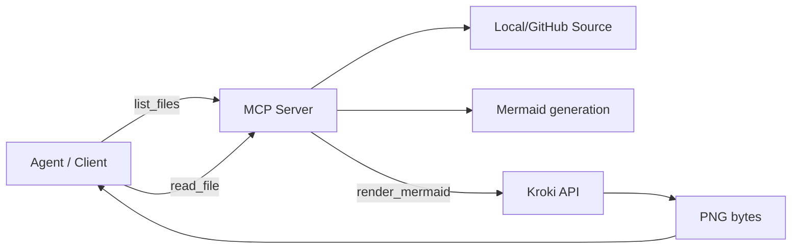

# mermaid-mcp — one MCP server to diagram any project (Local/GitHub → Mermaid → PNG)

**Mermaid MCP Server** is an MCP server that helps agents turn large codebases (local folders or GitHub repositories) into **Mermaid diagrams** and render them as **PNG images** via **Kroki**, enabling fast, reliable understanding of a project’s structure and flow.

## Why this server

When working with a new codebase, it’s easy to lose time jumping between folders and files. This server provides a clean, tool-based workflow for agents to **discover**, **read**, and **visualize** a project — without guessing paths or inventing structure.


## Key features

- **Local + GitHub sources**: analyze either a local project folder or a remote repository.
- **Agent-friendly pipeline**: `list_files` → `read_file` → generate Mermaid → `render_mermaid`.
- **Safe local access boundary**: local reads are restricted to `PROJECT_ROOT`.
- **Configurable limits**: control max file size (`MAX_FILE_CHARS`) and output directory (`DIAGRAM_OUT_DIR`).
- **Portable output**: rendered diagrams are returned as image content and also saved as PNG files.

## It exposes three tools:
| Tool | Description |
|------|-------------|
| `list_files` | List files from a local folder or a GitHub repo (supports root + glob filtering). |
| `read_file` | Read file contents (local or GitHub) with a configurable max length. |
| `render_mermaid` | Render Mermaid text via Kroki and return `ImageContent` (also saves to disk). |

### 1) `list_files`

Returns a list of files for a given source (`local` / `github`) with `root` + `glob` filtering.

#### Parameters

- `source`: `"local"` or `"github"`
- `root`: default `"."`
- `glob`: default `"**/*"`
- `repo_url`: required when `source="github"`
- `ref`: default `"main"`
- `recursive`: default `true`

#### Example (local)

```json
{
  "source": "local",
  "root": ".",
  "glob": "**/*.py",
  "recursive": true
}
```
#### Example (github)

```json
{
  "source": "github",
  "repo_url": "https://github.com/<owner>/<repo>",
  "ref": "main",
  "root": "src",
  "glob": "**/*.py",
  "recursive": true
}
```
### 2) `read_file`

Reads file contents (local or GitHub) with a length limit.

#### Parameters

- `source`: `"local"` or `"github"`
- `path`: required
- `repo_url`: required when `source="github"`
- `ref`: default `"main"`
- `max_chars`: default `MAX_FILE_CHARS`

#### Example (local)

```json
{
  "source": "local",
  "path": "src/server/server.py",
  "max_chars": 200000
}
```
#### Example (github)

```json
{
  "source": "github",
  "repo_url": "https://github.com/<owner>/<repo>",
  "ref": "main",
  "path": "README.md",
  "max_chars": 200000
}
```

### 3) `render_mermaid`

Accepts Mermaid text, renders it to a PNG via Kroki, returns `ImageContent`, and saves the file to disk.
#### Parameters

- `mermaid`: required (string) — the Mermaid diagram source text
- `title`: optional (string) — used to derive the output filename (will be sanitized)

#### Returns

- `ImageContent` containing the rendered PNG bytes
- Also writes the PNG file to `PROJECT_ROOT/DIAGRAM_OUT_DIR/<filename>.png`

#### Behavior

- If `mermaid` is empty → error
- File is saved under `DIAGRAM_OUT_DIR` (inside `PROJECT_ROOT`)
- Output path: the image is saved to `PROJECT_ROOT/DIAGRAM_OUT_DIR/<filename>.png` (default output dir: `./diagrams/`).
- Filename: derived from `title` (sanitized to be filesystem-safe). If `title` is missing, a default name is used.
- Name collisions: if `<filename>.png` already exists, it is overwritten.

#### Example

```json
{
  "mermaid": "flowchart LR\nA[Start] --> B[Build]\nB --> C[Run]\n",
  "title": "my_flow"
}
```

## Requirements

- Python 3.10+ (recommended)
- Internet access (for Kroki, and for GitHub when using `github` source)

---
## Project structure

```text
.
├── README.md
├── Dockerfile
├── pyproject.toml
├── .env.example
├── .gitignore
└── src/
    ├── config.py                  # Env/config defaults
    ├── server/                    # MCP server entrypoint
    │   └── server.py
    ├── tools/                     # MCP tools (list/read/render)
    │   ├── list_files.py
    │   ├── read_file.py
    │   └── render_mermaid.py
    ├── sources/                   # File sources behind one interface (Local / GitHub)
    │   ├── local_source.py
    │   ├── github_source.py
    │   └── source_factory.py
    ├── core/                      # Contracts + primitives (interfaces, errors, cache, pacing, rate limiting)
    │   ├── interfaces.py          # Source contract that shapes all implementations
    │   ├── models.py
    │   ├── errors.py
    │   ├── paths.py               # Shared path normalization + glob semantics (incl. **)
    │   ├── cache.py
    │   ├── pacing.py
    │   └── rate_limiter.py
    ├── clients/                   # External API clients (kept thin; shared policies live in core)
    │   ├── kroki_client.py
    │   └── github/
    │       ├── client.py          # HTTP + policy (cache/rate/pacing)
    │       ├── inputs.py          # normalize/validate inputs
    │       └── refs.py            # resolve refs (+ fallback)
    ├── resources/                 # Mermaid styles and small assets
    └── prompts/                   # Server-side canonical prompts
```
For architecture details, see: [ARCHITECTURE.md](./ARCHITECTURE.md)

### Docker (optional)

Build and run with Docker (example):

```bash
# build image
docker build -t mermaid-mcp:latest .

# run container (example, mount project root and set env vars)
docker run --rm -it \
  -v "$PWD":/app \
  -e PROJECT_ROOT=/app \
  -e KROKI_BASE_URL=https://kroki.io \
  -e KROKI_TIMEOUT=20 \
  -e DIAGRAM_OUT_DIR=diagrams \
  mermaid-mcp:latest
```

---
## Installation & Setup 

### 1) Clone the repo
```bash
git clone <REPO_URL>
cd <REPO_DIR>
```

### 2) Create a venv + install dependencies
##### Windows (PowerShell):
```powershell
python -m venv .venv
.\.venv\Scripts\Activate.ps1
pip install .[dev]
```
##### Windows (CMD):
```cmd
python -m venv .venv
.venv\Scripts\activate.bat
pip install .[dev]
```
##### macOS/Linux:
```bash
python -m venv .venv
source .venv/bin/activate
pip install .[dev]
```

> This installs runtime dependencies and development extras (tests).

### 3) Configuration (Environment Variables)
You can set env vars in your shell OR in the MCP client config that launches the server.

### Required / Recommended

| Variable | Description | Used by |
|---|---|---|
| `PROJECT_ROOT` | Local project root that the server is allowed to access (security boundary) | `local_source` |
| `KROKI_BASE_URL` | e.g. `https://kroki.io` | `render_mermaid` |
| `KROKI_TIMEOUT` | Kroki request timeout | `render_mermaid` |
| `DIAGRAM_OUT_DIR` | Where to save PNGs (**must be inside** `PROJECT_ROOT`) | `render_mermaid` |
| `MAX_FILE_CHARS` | Max characters to read from a file (prevents huge reads) | `read_file` |

### Optional

| Variable | Description | Used by |
|---|---|---|
| `HTTP_VERIFY` | Verify SSL certificates (as needed) | `server` |
| `GITHUB_TOKEN` | Recommended to avoid GitHub rate limits; if set, adds an `Authorization` header | `src/clients/github/client.py` |


Example (Windows)
```cmd
set PROJECT_ROOT=.
set KROKI_BASE_URL=https://kroki.io
set KROKI_TIMEOUT=20
set DIAGRAM_OUT_DIR=diagrams
set MAX_FILE_CHARS=200000
```
Example (macOS / Linux)
```bash
export PROJECT_ROOT=.
export KROKI_BASE_URL=https://kroki.io
export KROKI_TIMEOUT=20
export DIAGRAM_OUT_DIR=diagrams
export MAX_FILE_CHARS=200000
```
---
### 4) Run the server (stdio)
```bash
python src/server/server.py
```
#### Server name: `mermaid-mcp`

## Connect an MCP client (example: Claude Desktop)

Any MCP client that can launch a local stdio server can use this project. Below is an example configuration for Claude Desktop.

### 1) Locate Claude Desktop config
Claude Desktop stores MCP server definitions in a JSON config file.

Common locations:
- **Windows**: `%APPDATA%\Claude\claude_desktop_config.json`
- **macOS**: `~/Library/Application Support/Claude/claude_desktop_config.json`

> If the file doesn’t exist yet, create it.

---

### 2) Add this server to `claude_desktop_config.json`

Example (Windows):

```json
{
  "mcpServers": {
    "mermaid-mcp": {
      "command": "C:\\Users\\<YOU>\\path\\to\\repo\\.venv\\Scripts\\python.exe",
      "args": [
        "C:\\Users\\<YOU>\\path\\to\\repo\\src\\server\\server.py"
      ],
      "env": {
        "PROJECT_ROOT": "C:\\Users\\<YOU>\\path\\to\\repo",
        "KROKI_BASE_URL": "https://kroki.io",
        "KROKI_TIMEOUT": "20",
        "DIAGRAM_OUT_DIR": "diagrams",
        "MAX_FILE_CHARS": "200000"
      }
    }
  }
}
```
### 3) Restart Claude Desktop

After saving the config file, fully close Claude Desktop and reopen it so the server is loaded.

---

### 4) Verify tools are available

Open Claude Desktop and check that the server tools appear (e.g. `list_files`, `read_file`, `render_mermaid`).

---
## Using the canonical prompt

This project includes a canonical system prompt used to generate Mermaid diagrams in a consistent, tool-driven way. The prompt is registered on the MCP server under the name `generate_mermaid_canonical` and is defined in `src/prompts/mermaid_prompt.py`.

Two common ways to use it:

- Client-supported prompts (recommended): If your MCP client supports server-side prompts, select the server `mermaid-mcp`, pick the prompt named `generate_mermaid_canonical` from the prompt list, and run it as the agent's system/instruction before invoking the tools. Using the server-registered prompt ensures agents always get the latest prompt text.

- Copy & paste: If your client does not support server-side prompts, open `src/prompts/mermaid_prompt.py`, copy the prompt text, and paste it into the agent's system message or save it locally as a preset. Keep in mind you will need to update your local copy when the repository prompt changes.

Notes:
- The canonical prompt enforces strict tool usage and requires the canonical style resource `mermaid://styles/blue-flowchart` to be read and embedded unchanged into generated diagrams.
- The prompt expects the agent to follow the pipeline: `list_files` → `read_file` → generate Mermaid → `render_mermaid`.

## Testing

Run the test suite:

```bash
pytest -q
```
---
## End-to-end example:

This is a complete, realistic flow that demonstrates the intended pipeline:
`list_files` → `read_file` → generate Mermaid → `render_mermaid`.

### Step 1 — List files from a GitHub repo

```json
{
  "source": "github",
  "repo_url": "https://github.com/<owner>/<repo>",
  "ref": "main",
  "root": "src",
  "glob": "**/*.py",
  "recursive": true
}
```
### Step 2 — Pick a small set of important files (5–12)

Example selection (you choose based on what the repo contains):
- `src/server/server.py`
- `src/tools/list_files.py`
- `src/tools/read_file.py`
- `src/tools/render_mermaid.py`
- `src/core/interfaces.py`
- `src/clients/github/client.py`
- `src/clients/github/refs.py`
- `src/core/cache.py`
- `src/core/pacing.py`
- `src/core/rate_limiter.py`
- `src/clients/kroki_client.py`

### Step 3 — Read the chosen files
```json
{
  "source": "github",
  "repo_url": "https://github.com/<owner>/<repo>",
  "ref": "main",
  "path": "src/server/server.py",
  "max_chars": 200000
}
```
### Step 4 — Generate Mermaid from what you read

### Step 5 — Render Mermaid to PNG
```json
{
  "mermaid": "<paste the Mermaid from Step 4 (or the generated Mermaid diagram)>",
  "title": "repo_to_diagram"
}
``` 
---

## Security & Predictable Behavior

For security and predictable behavior, see: [Security boundaries](./ARCHITECTURE.md#security-boundaries-and-predictable-behavior)


---

## Troubleshooting

- `"Missing repo_url for github source"` → you forgot `repo_url` with `source="github"`
- `"Missing file path"` → you called `read_file` without `path`
- `"Access outside project root is not allowed"` → attempted to read outside `PROJECT_ROOT`
- `"DIAGRAM_OUT_DIR must be within PROJECT_ROOT"` → output dir is not inside `PROJECT_ROOT`

## Future work (additional sources)

Next, we plan to support more input sources beyond local folders and GitHub, so the server can generate Mermaid diagrams from additional code hosts and content providers (e.g., GitLab, Bitbucket, Azure DevOps Repos, as well as ZIP archives or single files via URL).

This will build on a unified `Source` abstraction: each new source will implement the same contract (`list_files` and `read_file`), while the tools remain unchanged—extending support will require only adding a new source implementation and registering it in the factory.

